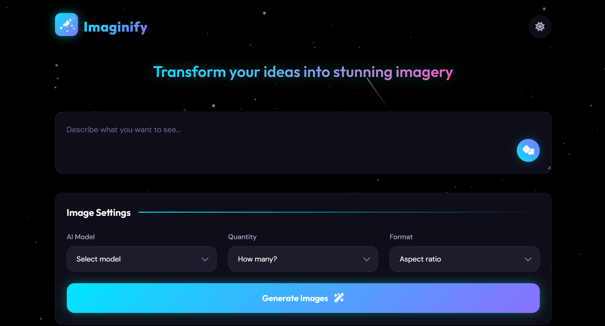

# Imaginify | AI Image Generator

A beautiful, responsive web application that generates AI images using various models from Hugging Face. Built with vanilla JavaScript, HTML, and CSS.

## 🌟 Features

- **Multiple AI Models**: Choose from various AI image generation models including FLUX.1-dev, FLUX.1-schnell, Stable Diffusion XL, Stable Diffusion v1.5, and Openjourney
- **Customizable Output**: Select the number of images to generate (1-4) and aspect ratio (square 1:1, landscape 16:9, portrait 9:16)
- **Dark/Light Theme**: Toggle between dark and light themes with a single click
- **Responsive Design**: Works seamlessly on desktop, tablet, and mobile devices
- **Random Prompt Generator**: Get inspiration with the random prompt generator
- **Image Download**: Easily download generated images with a single click
- **Loading States**: Visual feedback during image generation
- **Error Handling**: Graceful error handling with user-friendly messages
- **Beautiful UI**: Animated background with particles and stars for an immersive experience

## 🚀 Technologies Used

- HTML5
- CSS3 (with CSS variables for theming)
- Vanilla JavaScript (ES6+)
- Hugging Face Inference API
- Font Awesome Icons

## 📋 Prerequisites

- A modern web browser (Chrome, Firefox, Safari, Edge)
- Internet connection
- Hugging Face API key (get one for free at [Hugging Face](https://huggingface.co/settings/tokens))

## 🛠️ Installation

1. Clone the repository:
   ```bash
   git clone https://github.com/yourusername/imaginify-ai-image-generator.git
   ```

2. Navigate to the project directory:
   ```bash
   cd imaginify-ai-image-generator
   ```

3. Open `index.html` in your browser or use a local server:
   ```bash
   # Using Python
   python -m http.server
   
   # Using Node.js
   npx serve
   ```

## 💡 Usage

1. Enter a prompt describing the image you want to generate
2. Select an AI model from the dropdown menu
3. Choose how many images you want to generate (1-4)
4. Select an aspect ratio (square, landscape, portrait)
5. Click the "Generate" button
6. Wait for the images to be generated
7. Download the images by hovering over them and clicking the download button

## 🔧 Configuration

To use your own Hugging Face API key:

1. Sign up for a Hugging Face account at [huggingface.co](https://huggingface.co)
2. Generate an API key from your account settings
3. Replace the API key in `script.js`:
   ```javascript
   const API_KEY = "your_api_key_here";
   ```

## 📸 Screenshots

### Light Theme


### Dark Theme


## 🤝 Contributing

Contributions are welcome! Please feel free to submit a Pull Request.

1. Fork the repository
2. Create your feature branch (`git checkout -b feature/amazing-feature`)
3. Commit your changes (`git commit -m 'Add some amazing feature'`)
4. Push to the branch (`git push origin feature/amazing-feature`)
5. Open a Pull Request

## 📄 License

This project is licensed under the MIT License - see the [LICENSE](LICENSE) file for details.

## 🙏 Acknowledgments

- [Hugging Face](https://huggingface.co) for providing the AI models
- [Font Awesome](https://fontawesome.com) for the icons
- [Google Fonts](https://fonts.google.com) for the typography (Outfit and DM Sans)
- [Particles.js](https://github.com/VincentGarreau/particles.js/) for the animated background effects

